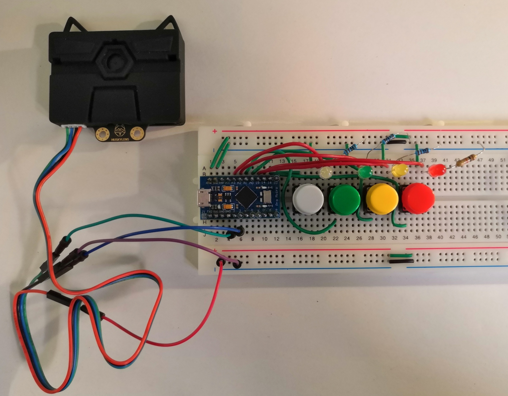
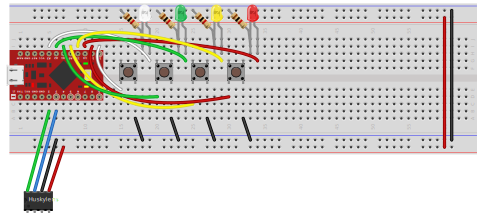

# Interactive AI with Huskylens

Play and understand how AI Classification works.

- Input: Use the 4 buttons to interactively (and iteratively) teach the model (4 possible classes).
- Output: At any time, see what the Huskylens detects on one of the 4 leds.

Example use case:

Facecover detection

You can for example teach the Huskylens if the user is wearing a face cover correctly:
- Red: No face cover or very badly worn
- Yellow: Face cover is incorrectly worn (under the nose for example)
- Green: Face cover is correctly worn
- White: Other case (nobody in front of camera for example)

How to use: Teach with the 4 buttons. If the detected class is wrong, press the corresponding button to correct the model.

When you press a button, the model will learn a new frame for the class you have selected.

# Hardware

- [DFRobot Huskylens](https://wiki.dfrobot.com/HUSKYLENS_V1.0_SKU_SEN0305_SEN0336#target_0): an easy-to-use AI machine vision sensor with 7 built-in algorithms: face recognition, object tracking, object recognition, line tracking, color recognition, tag recognition and object classification. Kendryte K210 Processor and OV2640 camera.
- [Sparkfun Pro Micro (ATmega32U4) 5V 16Mhz](https://learn.sparkfun.com/tutorials/pro-micro--fio-v3-hookup-guide/)
- Breadboard, leds, pushbuttons and hookup wires.

## Connection diagram

- Communication with the Huslylens is via I2C

## Power

The Sparkfun Pro Micro board is powered via USB, it then powered the breadboard.

Although on the diagram I have connected the Huskylens to the power rail, I have found it was more reliable to also power it via USB.

# Software

We need firmware V0.5.1 or superior for the Huskylens (it includes classification, and class naming functions).

See code in the repo:
- [huskylens.ino](huskylens.ino): Arduino sketch

